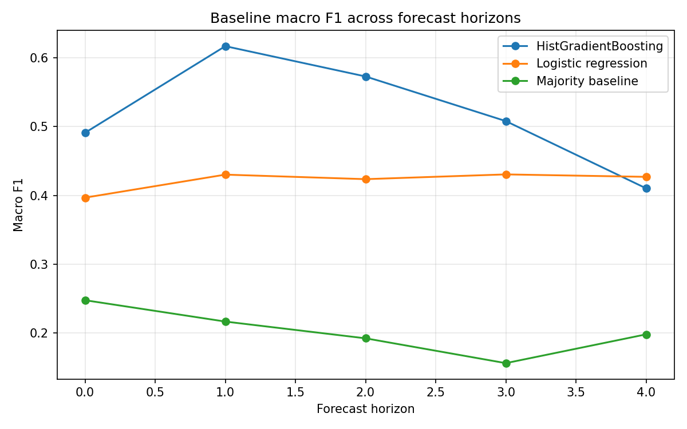
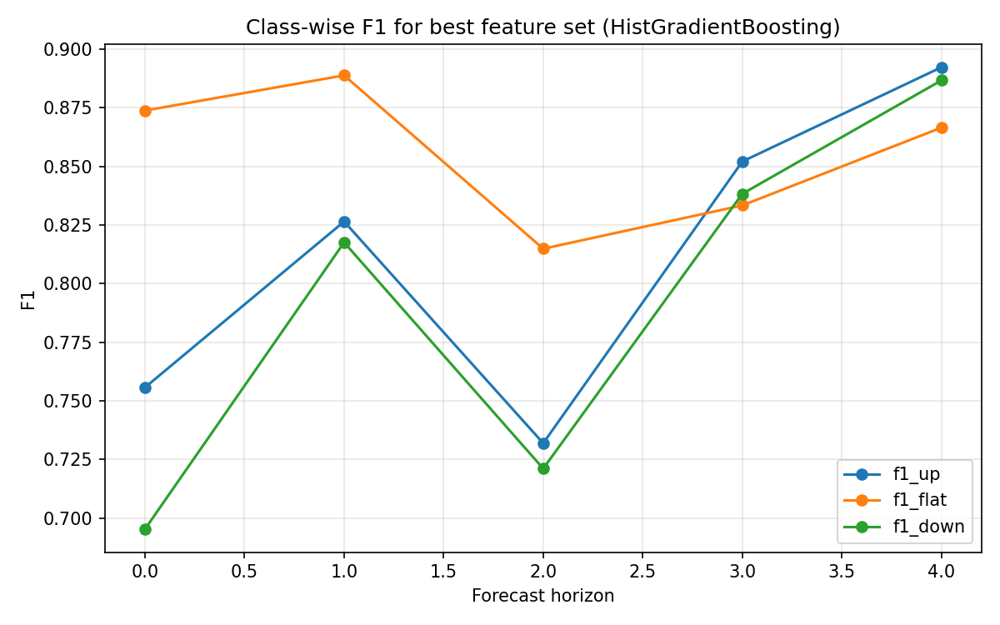

# Limit Order Book Forecasting with Microstructure Features

This project studies short-horizon mid-price movement prediction using the FI-2010 limit order book benchmark dataset. It tests whether order book states, engineered microstructure features, and recent market context contain predictive information about near-term price movement. The pipeline covers data loading, feature engineering, horizon-wise evaluation, and feature-family ablations, with next steps toward calibration, signal generation, and execution-aware evaluation.

## Research Questions

1. Can limit order book snapshots predict short-horizon mid-price movement?
2. How does predictive performance vary across FI-2010 forecast horizons?
3. Do nonlinear models capture useful structure beyond linear baselines?
4. Do engineered microstructure features add predictive value beyond the original 144 FI-2010 benchmark features?
5. Does recent order book context, such as rolling returns, volatility, spread, and imbalance, improve prediction quality?

## Dataset

- FI-2010 limit order book snapshots labeled for five forecast horizons.
- Labels: 1 = up, 2 = flat, 3 = down.
- Representations: Zscore (benchmark features) and DecPre (decimal-preserved for microstructure reconstruction).

## Methodology

### Feature Families

- Benchmark 144 (Zscore).
- Basic microstructure (spread, imbalance, microprice, depth).
- Rolling-context microstructure (returns, volatility, spread and imbalance stats).
- Combined benchmark + rolling-context.

### Models

- majority-class baseline
- logistic regression
- HistGradientBoosting

### Evaluation

- accuracy, macro F1, class-wise F1 (macro F1 emphasized for class balance).

## Key Results

### Horizon-3 Baseline Results

Initial models using the original 144 FI-2010 benchmark features showed clear predictive signal beyond the majority baseline.

| Model | Accuracy | Macro F1 |
|---|---:|---:|
| Majority baseline | 0.306 | 0.156 |
| Logistic regression | 0.439 | 0.431 |
| HistGradientBoosting | 0.522 | 0.508 |

### Feature-Family Comparison

The strongest feature family was the combined representation: original 144 Zscore benchmark features plus rolling-context microstructure features.

Best HistGradientBoosting macro-F1 results by forecast horizon:

| Horizon | Best Feature Set | Macro F1 |
|---|---|---:|
| 0 | Zscore + context microstructure | 0.775 |
| 1 | Zscore + context microstructure | 0.844 |
| 2 | Zscore + context microstructure | 0.756 |
| 3 | Zscore + context microstructure | 0.841 |
| 4 | Zscore + context microstructure | 0.882 |

### Main Findings

- Benchmark features contain meaningful predictive signal beyond class imbalance.
- Nonlinear models outperform linear models on stronger feature representations.
- Rolling-context features outperform static microstructure features.
- Removing absolute price-level features does not materially reduce performance.
- Combining benchmark + rolling-context features gives the strongest overall performance.

## Results Visualizations

<table>
	<tr>
		<td></td>
		<td></td>
	</tr>
	<tr>
		<td colspan="2"></td>
	</tr>
</table>

## Current Status

Completed:

- data loading utilities
- horizon-wise baselines
- microstructure features
- rolling-context features
- feature-family ablations

In progress:

- probability and confidence analysis
- BUY / SELL / HOLD signal generation
- execution-cost-aware backtesting
- regime-wise evaluation

## Next Steps

- confidence-bucket accuracy and calibration diagnostics
- threshold-based signal generation
- execution-aware PnL simulation
- regime-wise signal performance

## Note on AI Assistance

AI tools were used to assist with boilerplate utility code, code organization, documentation drafting, and refactoring suggestions. Core project decisions, experiment design, model evaluation, result interpretation, and final analysis are reviewed and validated manually.
