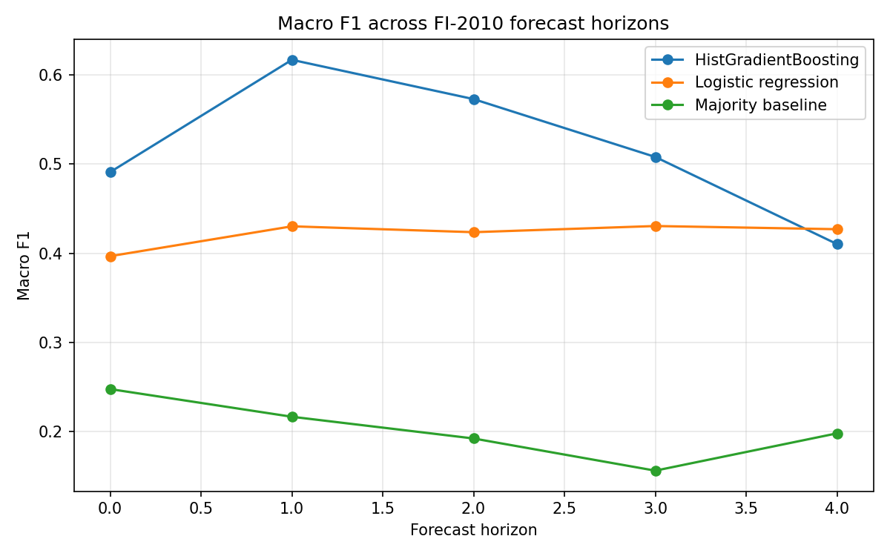
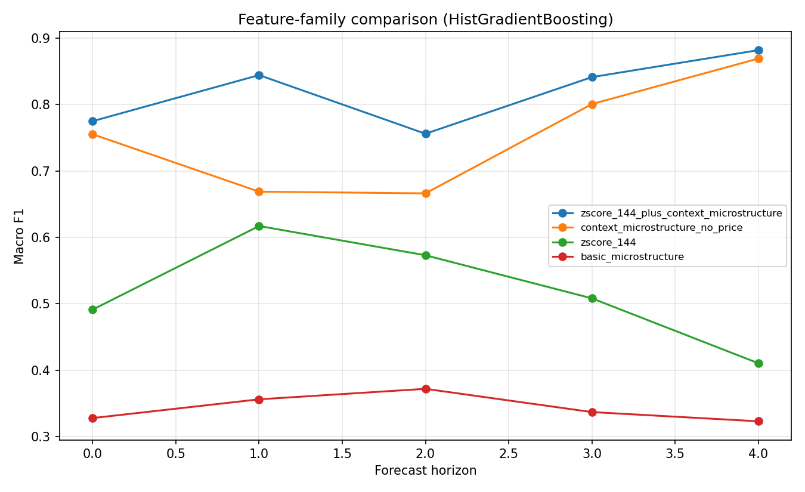

# Limit Order Book Forecasting

This project studies short-horizon mid-price movement prediction using the FI-2010 limit order book benchmark dataset. The goal is to understand whether limit order book states, engineered microstructure features, and recent order book context contain predictive information about near-term price movement.

The project is built as a research-oriented pipeline rather than a single notebook experiment. It includes reusable data loading utilities, baseline model benchmarks, microstructure feature engineering, feature-family ablation studies, and planned execution-aware signal evaluation.

## Core Questions

1. Can limit order book snapshots predict short-horizon mid-price movement?
2. How does predictive performance change across the five FI-2010 forecast horizons?
3. Do nonlinear models capture useful structure beyond linear baselines?
4. Which feature families are most predictive: raw benchmark features, static microstructure features, rolling-context microstructure features, or combined features?
5. Can model probabilities eventually be converted into BUY / SELL / HOLD signals that survive bid-ask spread costs?

## Dataset

The project uses the FI-2010 limit order book dataset. Each FI-2010 file is stored in a transposed format:

```text
raw shape: variables x samples

After loading and transposing:

X shape: n_samples x 144
y shape: n_samples x 5

The first 144 columns are input features. The last 5 columns are labels for five different forecast horizons.
```

Labels:

1 = future mid-price moves up
2 = future mid-price remains stationary / flat
3 = future mid-price moves down

Two FI-2010 representations are used:

- Zscore: normalized benchmark features used for baseline modeling.
- DecPre: decimal-preserved representation used to reconstruct interpretable bid/ask price and size relationships.

## Project Structure

```text
notebooks/
  01_fi2010_data_exploration.ipynb
  02_baseline_models.ipynb
  03_horizon_comparision.ipynb
  04_microstructure_features.ipynb
  05_feature_family_comparision.ipynb

src/lob_forecasting/
  __init__.py
  data.py
  evaluation.py
  features.py
  models.py

experiments/
  baseline_results_cf1_horizon3.csv
  custom_microstructure_results_horizon3.csv
  feature_family_results_cf1.csv
  horizon_results_cf1.csv
  microstructure_feature_results_horizon3.csv

reports/
  figures/
  research_memo.md
```

## Completed Work

### 1. Data Loading and Exploration

Implemented reusable FI-2010 loading utilities in `src/lob_forecasting/data.py`.

The data loader:

- loads FI-2010 train/test files,
- transposes the raw matrix into samples x variables,
- splits features and labels,
- supports multiple FI-2010 preprocessing variants such as Zscore and DecPre.

Notebook 01 documents the dataset structure, feature/label layout, and target distributions across forecast horizons.

### 2. Baseline Model Benchmark

Notebook 02 evaluates the initial horizon-3 benchmark using:

- majority-class baseline,
- logistic regression,
- HistGradientBoosting.

Initial horizon-3 results:

| Model | Accuracy | Macro F1 |
|---|---:|---:|
| Majority baseline | ~0.306 | ~0.156 |
| Logistic regression | ~0.439 | ~0.431 |
| HistGradientBoosting | ~0.522 | ~0.508 |

This establishes that the FI-2010 features contain predictive signal beyond class imbalance, and that nonlinear tabular models improve over linear baselines.

### 3. All-Horizon Benchmark

Notebook 03 extends the baseline comparison across all five FI-2010 forecast horizons.

This experiment evaluates:

3 models x 5 horizons

and saves results to:

`experiments/horizon_results_cf1.csv`

The all-horizon benchmark shows that predictive performance varies meaningfully by forecast horizon, and that macro F1 is more informative than accuracy alone because some models perform poorly on the stationary/flat class even when accuracy appears reasonable.

### 4. Microstructure Feature Engineering

Notebook 04 reconstructs the top-10 limit order book from the DecPre representation and engineers interpretable microstructure features.

Static/current-snapshot features include:

- mid-price,
- spread,
- level-1 imbalance,
- microprice,
- microprice deviation,
- bid depth over 5 and 10 levels,
- ask depth over 5 and 10 levels,
- multi-level depth imbalance.

Rolling/context features include:

- mid-price return over 1, 5, and 10 snapshots,
- rolling volatility over 10 and 50 snapshots,
- rolling spread mean and standard deviation,
- rolling imbalance mean and standard deviation,
- rolling microprice-deviation mean and standard deviation.

A horizon-3 comparison showed that basic one-snapshot microstructure features contain some signal but are much weaker than the full FI-2010 benchmark representation. Adding rolling context produced a large improvement, showing that recent mid-price dynamics and persistent microstructure pressure are important.

### 5. Feature-Family Ablation Study

Notebook 05 compares multiple feature families across all five horizons.

Feature families:

1. zscore_144
    Full normalized FI-2010 benchmark features.
2. basic_microstructure
    Static interpretable features such as spread, imbalance, microprice deviation, and depth imbalance.
3. context_microstructure_no_price
    Rolling/context microstructure features with absolute price-level features removed.
4. zscore_144_plus_context_microstructure
    Full 144 benchmark features combined with engineered rolling-context microstructure features.

Models:

- logistic regression,
- HistGradientBoosting.

This gives:

4 feature sets x 5 horizons x 2 models = 40 experiments

Results are saved to:

`experiments/feature_family_results_cf1.csv`

The strongest feature family is the combined representation:

zscore_144_plus_context_microstructure

with HistGradientBoosting.

Best macro-F1 results by horizon:

| Horizon | Best Feature Set | Best Model | Macro F1 |
|---|---|---|---:|
| 0 | zscore + context microstructure | HistGradientBoosting | ~0.775 |
| 1 | zscore + context microstructure | HistGradientBoosting | ~0.844 |
| 2 | zscore + context microstructure | HistGradientBoosting | ~0.756 |
| 3 | zscore + context microstructure | HistGradientBoosting | ~0.841 |
| 4 | zscore + context microstructure | HistGradientBoosting | ~0.882 |

The context microstructure features alone also outperform the original 144-feature benchmark across horizons. This indicates that recent returns, rolling volatility, persistent imbalance, and rolling microprice pressure provide substantial predictive information.

## Key Findings So Far

1. The original FI-2010 benchmark features contain predictive signal beyond the majority baseline.
2. Nonlinear models outperform linear models on the full benchmark representation.
3. Static one-snapshot microstructure features are interpretable but insufficient by themselves.
4. Rolling/context microstructure features substantially improve prediction quality.
5. Removing absolute price-level features does not materially harm the context-feature performance, suggesting that the improvement is not primarily driven by absolute price-level shortcuts.
6. The best results come from combining the original 144 normalized benchmark features with engineered rolling-context microstructure features.
7. Feature quality matters more than model complexity alone: context microstructure features with logistic regression outperform basic microstructure features with HistGradientBoosting.

## Results Figures

### Horizon Benchmark



### Feature-Family Comparison (HistGradientBoosting)



## Current Status

The project has completed data loading, dataset exploration, baseline modeling, all-horizon benchmarking, microstructure feature engineering, and feature-family comparisons across horizons. Current work is focused on refactoring model and evaluation helpers into reusable source modules and preparing for confidence/probability analysis.

## Next Steps

### 1. Probability and Confidence Analysis

The next stage will analyze model probability outputs.

Questions:

- When the model is confident, is it actually more accurate?
- Are high-confidence predictions reliable enough to become trading signals?
- How do confidence thresholds affect class-wise accuracy?

Planned outputs:

- confidence bucket analysis,
- probability distribution plots,
- log loss / probability quality metrics,
- accuracy by confidence threshold.

### 2. BUY / SELL / HOLD Signal Generation

Convert model probabilities into discrete trading actions:

P(up) high enough   -> BUY
P(down) high enough -> SELL
otherwise           -> HOLD

This will make the project move from classification to signal generation.

### 3. Execution-Aware Backtesting

Evaluate signals under realistic execution assumptions:

BUY  -> enter at ask, exit at future mid
SELL -> enter at bid, exit at future mid
HOLD -> no trade

Metrics:

- number of trades,
- hit rate,
- average PnL per trade,
- total PnL,
- drawdown,
- PnL by confidence threshold.

### 4. Regime Analysis

Break performance down by market conditions:

- tight vs wide spread,
- high vs low imbalance,
- high vs low volatility,
- high vs low confidence,
- liquid vs shallow book regimes.

This will help identify when the model works and when it fails.

## Note on AI Assistance

AI tools were used to assist with boilerplate utility code, code organization, documentation drafting, and refactoring suggestions. Core project decisions, experiment design, model evaluation, result interpretation, and final analysis are reviewed and validated manually by me.
